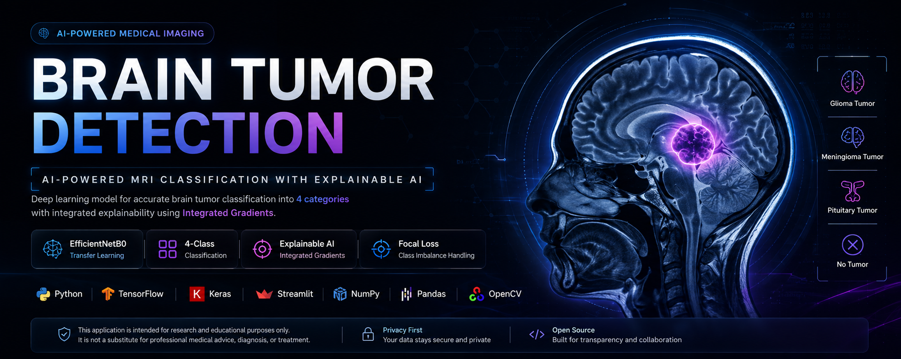
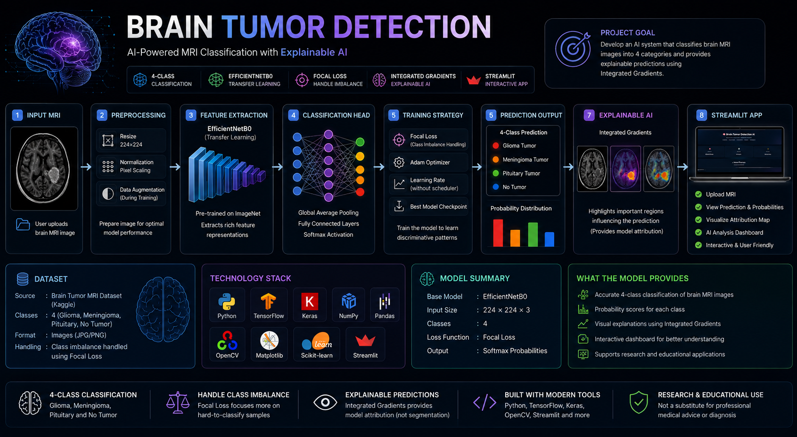

<div align="center">



# 🧠 Brain Tumor Detection AI

### AI-Powered MRI Classification with EfficientNetB0 & Explainable AI

<p>
  <a href="https://brain-tumor-detection-alin.streamlit.app">
    
  </a>
  
  
  
</p>

<p>
  <b>Computer Vision</b> · <b>Medical AI</b> · <b>Transfer Learning</b> · <b>Explainable AI</b>
</p>

</div>

---

## 🎯 Project Overview

**Brain Tumor Detection AI** is an end-to-end deep learning application designed to classify brain MRI images into four categories using a transfer-learning-based **EfficientNetB0** architecture.

The system combines image classification with **Integrated Gradients** to provide a visual explanation of the regions that contributed to the model's prediction.

The trained model is integrated into an interactive **Streamlit** application where users can upload an MRI image, view the predicted class, inspect class probabilities, and explore the model's attribution map.

> **Project focus:** building a practical, explainable and deployable computer-vision workflow rather than presenting the system as a clinical diagnostic tool.

---

## 🚀 Live Application

<div align="center">

### [🚀 Launch Brain Tumor Detection AI](https://brain-tumor-detection-alin.streamlit.app)

*Explore the deployed application and test the complete inference workflow.*

</div>

---

## ✨ Key Capabilities

| Capability | Implementation |
|---|---|
| 🧠 Model Architecture | EfficientNetB0 |
| 🔄 Learning Strategy | Transfer Learning |
| 🏷️ Classification | 4-Class MRI Classification |
| 🔬 Computer Vision | MRI Image Analysis |
| 🤖 Framework | TensorFlow / Keras |
| 🔍 Explainability | Integrated Gradients |
| 📊 Output | Prediction + Class Probabilities |
| 🌐 Deployment | Streamlit Community Cloud |
| 🎨 Interface | Custom Streamlit UI + CSS |

---

## 🖥️ Application Preview

The application provides a complete inference interface — from MRI upload to classification, probability analysis and explainability.

<div align="center">


</div>

---

## 🧩 Classification Classes

The model performs multi-class classification across four categories:

| Class | Description |
|---|---|
| 🧠 Glioma Tumor | Glioma category |
| 🔬 Meningioma Tumor | Meningioma category |
| ✅ No Tumor | No-tumor category |
| 🧬 Pituitary Tumor | Pituitary category |

The model returns a probability distribution across all four classes rather than only displaying the predicted label.

---

## ⚙️ How the System Works

```text
                    MRI IMAGE
                        │
                        ▼
              Image Preprocessing
                        │
                        ▼
                EfficientNetB0
                 Transfer Learning
                        │
                        ▼
              4-Class Classification
                        │
             ┌──────────┴──────────┐
             ▼                     ▼
       Class Prediction      Probability Scores
             │
             ▼
      Integrated Gradients
             │
             ▼
       Visual Attribution
```

---

## 🏗️ Model Architecture

The model uses **EfficientNetB0** as the core transfer-learning architecture for extracting visual features from MRI images.

<div align="center">



</div>

The trained network produces a probability distribution across the four target categories, allowing the application to display both the predicted class and class-wise probabilities.

---

## 📊 Test Performance

The final **EfficientNetB0 + Focal Loss** model achieved **77.41% test accuracy** on the held-out test set.

| Class | Precision | Recall | F1-Score |
|---|---:|---:|---:|
| 🧠 Glioma Tumor | 0.56 | 0.15 | 0.24 |
| 🔬 Meningioma Tumor | 0.63 | 0.72 | 0.67 |
| ✅ No Tumor | 0.66 | 0.83 | 0.73 |
| 🧬 Pituitary Tumor | 0.61 | 0.85 | 0.71 |
| **Overall Accuracy** | — | — | **77.41%** |

**Macro F1-Score:** 0.74 · **Weighted F1-Score:** 0.73

## Performance Interpretation

The model demonstrates comparatively stronger performance on **Meningioma, No Tumor and Pituitary Tumor** categories.

**Glioma Tumor is the most challenging class for the current model**, with a substantially lower recall of **0.15**. This means that a portion of actual Glioma cases may be missed by the classifier.

The project intentionally reports this class-specific limitation rather than relying only on the overall accuracy.

---

## 📈 Prediction & Probability Analysis

The application provides the predicted class together with the probability distribution across all four categories.

<div align="center">


</div>

The inference interface provides:

- 🎯 Predicted class
- 📊 Class-wise probabilities
- 🔢 Model confidence
- 🖼️ Uploaded MRI information
- 🔍 Explainability output

The probability distribution provides additional context around the prediction instead of presenting only a single class label.

---

## 🔍 Explainable AI

To make the prediction process more interpretable, the application incorporates **Integrated Gradients**.

<div align="center">


</div>

Integrated Gradients generates an attribution map showing image regions associated with the model's prediction.

```text
Input MRI
    │
    ▼
Model Prediction
    │
    ▼
Selected Target Class
    │
    ▼
Gradient-based Attribution
    │
    ▼
Integrated Gradients
    │
    ▼
Visual Attribution Map
```

> **Important:** The attribution map represents model behavior and is not a tumor segmentation mask, exact lesion boundary, or clinically validated diagnostic interpretation.

---

## 🖥️ Model Analysis Dashboard

The application combines prediction, probability analysis and explainability into a unified interface.

<div align="center">


</div>

This creates a complete inference workflow:

**MRI Input → Prediction → Probability Analysis → Model Explanation**

---

## 🧠 What the Model Does Well

The project demonstrates several practical capabilities within a single deployable deep-learning workflow.

| Strength | Description |
|---|---|
| ⚡ Efficient Architecture | EfficientNetB0 provides a compact transfer-learning backbone |
| 🎯 Multi-Class Prediction | Classifies MRI inputs across four defined categories |
| 📊 Probability Output | Provides class-wise prediction probabilities |
| 🔍 Explainability | Integrated Gradients provides visual model attribution |
| 🌐 Deployment | Complete inference workflow is available through Streamlit |
| 🖥️ Interactive Interface | Prediction and analysis are presented through a custom UI |
| 📌 Transparent Evaluation | Class-level metrics are reported alongside overall accuracy |

---

## ⚠️ Limitations & Honest Assessment

A multi-class model should not be evaluated using overall accuracy alone. The validation results show that performance varies between individual categories.

### Current Limitations

- **Glioma recall is comparatively lower** than the other evaluated classes and is the primary class-specific limitation of the current model.
- The model can become less confident when an MRI differs substantially from the data distribution used during development.
- Image quality and acquisition characteristics can influence model predictions.
- Ambiguous or unfamiliar images may result in incorrect classifications.
- Integrated Gradients provides model attribution, not a clinically validated tumor boundary.
- The reported validation performance should not be interpreted as clinical-grade diagnostic accuracy.

> **These limitations are intentionally documented to make the project transparent and realistic rather than presenting the model as infallible.**

---

---

## ⚕️ Class-Specific Reliability Precaution

**Glioma Tumor is the most challenging class for the current model.** Predictions for Glioma should therefore be treated with additional caution, particularly when MRI images are ambiguous, low-quality or substantially different from the data used during model development.

More generally, predictions across all four classes can be incorrect and should not be interpreted as a medical diagnosis.

> **Important:** This system is an educational and research-oriented AI prototype. It should not be used to confirm or rule out a brain tumor or replace professional radiological or clinical assessment.

---

## 🧪 Evaluation Philosophy

The model is evaluated using multiple classification metrics to provide a broader view of performance.

| Metric | Purpose |
|---|---|
| 🎯 Precision | Measures how often predictions for a class are correct |
| 🔎 Recall | Measures how effectively actual instances of a class are identified |
| ⚖️ F1-Score | Balances precision and recall |
| 📊 Accuracy | Measures overall classification correctness |

Class-level evaluation is particularly important because the four categories do not perform identically.

---

## 🛠️ Technology Stack

| Layer | Technology |
|---|---|
| 🐍 Programming | Python |
| 🧠 Deep Learning | TensorFlow / Keras |
| 🏗️ Architecture | EfficientNetB0 |
| 🔄 Learning Strategy | Transfer Learning |
| 🎯 Loss Function | Focal Loss |
| 👁️ Image Processing | OpenCV / Pillow |
| 🔢 Numerical Computing | NumPy |
| 📊 Data Processing | Pandas |
| 📈 Visualization | Plotly |
| 🔍 Explainability | Integrated Gradients |
| 🌐 Application | Streamlit |
| 🎨 Interface | Custom CSS |
| ☁️ Deployment | Streamlit Community Cloud |

---

## 📁 Project Structure

```text
brain-tumor-detection/
│
├── .streamlit/
│   └── config.toml
|
├── assets/
│   └── screenshots/
│       ├── Application Preview.png
│       ├── Integrated Gradients.png
│       ├── Model Analysis Dashboard.png
│       ├── Prediction & Probability.png
│       ├── architecture.png
│       └── hero_banner.png
│
├── app.py
├── utils.py
├── best_brain_tumor_model.keras
├── Brain_Tumor_Detection.ipynb
├── requirements.txt
├── style.css
├── .gitignore
├── LICENSE
└── README.md
```

### Core Components

| File | Purpose |
|---|---|
| `app.py` | Streamlit application and inference interface |
| `utils.py` | Prediction, preprocessing and explainability utilities |
| `best_brain_tumor_model.keras` | Trained EfficientNetB0-based classification model |
| `style.css` | Custom application styling |
| `requirements.txt` | Python dependencies |
| `assets/` | Project screenshots and visual documentation |

---

## 🚀 Run Locally

### 1. Clone the repository

```bash
git clone https://github.com/alinkumar/brain-tumor-detection.git
cd brain-tumor-detection
```

### 2. Install dependencies

```bash
pip install -r requirements.txt
```

### 3. Launch the application

```bash
streamlit run app.py
```

The application will start through the local Streamlit server.

---

## 🌐 Live Demo

<div align="center">

### 🚀 Brain Tumor Detection AI

**Explore the deployed application and interact with the complete inference workflow.**

<br>

<a href="https://brain-tumor-detection-alin.streamlit.app">


</a>

<br><br>

<sub>
MRI Classification · Probability Analysis · Integrated Gradients
</sub>

</div>

---

## 🧭 End-to-End Workflow

```text
                         MRI IMAGE
                             │
                             ▼
                    Image Preprocessing
                             │
                             ▼
                       EfficientNetB0
                             │
                             ▼
                    4-Class Prediction
                             │
                ┌────────────┴────────────┐
                ▼                         ▼
        Class Prediction          Probability Scores
                │
                ▼
        Integrated Gradients
                │
                ▼
          Attribution Map
                │
                └────────────┬────────────┘
                             ▼
                   Streamlit Application
                             │
                             ▼
                      Cloud Deployment
```

The project connects image preprocessing, model inference, probability analysis, explainability and deployment into one end-to-end computer-vision workflow.

---

## 🎓 Learning Outcomes

This project provided practical experience across the modern deep-learning lifecycle:

- 🧠 Transfer learning with EfficientNetB0
- 🖼️ Multi-class image classification
- ⚙️ TensorFlow / Keras model development
- 🎯 Focal Loss
- 📊 Class-level model evaluation
- 🔍 Explainable AI with Integrated Gradients
- 📈 Probability-based prediction analysis
- 🖥️ Streamlit application development
- ☁️ Cloud deployment
- 🧩 Responsible model reporting

---

## ⚕️ Responsible Use

> **This project is intended for educational, research and AI-assisted demonstration purposes only.**

It is **not a medical device** and does not provide a medical diagnosis.

Predictions generated by the system may be incorrect and should not replace professional radiological assessment, clinical evaluation or medical decision-making.

The model's confidence score represents the classifier's estimated probability distribution and should **not** be interpreted as clinical certainty.

---

## 🔐 Transparency Note

The application intentionally separates three different concepts:

| Concept | Meaning |
|---|---|
| 📊 Model Performance | Measured through validation metrics |
| 🎯 Prediction Confidence | Probability distribution produced by the classifier |
| 🔍 Model Explanation | Attribution visualization produced using Integrated Gradients |

A high confidence score does not guarantee that a prediction is correct.

Similarly, an Integrated Gradients visualization indicates regions associated with model behavior; it does **not** represent a clinically validated tumor segmentation.

---

## 📌 Project Status

<div align="center">

| Component | Status |
|---|:---:|
| 🧠 Deep Learning Model | ✅ Complete |
| 📊 Model Evaluation | ✅ Complete |
| 🎯 Prediction Pipeline | ✅ Complete |
| 🔍 Explainable AI | ✅ Integrated |
| 🖥️ Streamlit Interface | ✅ Complete |
| ☁️ Cloud Deployment | ✅ Live |
| 📚 Documentation | ✅ Complete |

</div>

---

## 🚀 Future Improvements

Potential directions for future iterations include:

- Improving class-specific recall, particularly for challenging categories
- Evaluating the model on larger and more diverse datasets
- Comparing additional pretrained architectures
- Improving probability calibration
- Expanding explainability evaluation
- Performing broader external validation
- Investigating robustness across different MRI acquisition conditions

These are **future development directions**, not capabilities currently claimed by the deployed system.

---

## 👨‍💻 Author

<div align="center">

# Alin Kumar

### Data Science & AI Portfolio Project

**Computer Vision · Deep Learning · Explainable AI · Deployment**

<br>

<a href="https://github.com/alinkumar">


</a>

</div>

---

## ⭐ Explore the Project

<div align="center">

### 🧠 Brain Tumor Detection AI

**EfficientNetB0 · Transfer Learning · Focal Loss · Integrated Gradients · Streamlit**

<br>

<a href="https://brain-tumor-detection-alin.streamlit.app">


</a>

&nbsp;&nbsp;

<a href="https://github.com/alinkumar/brain-tumor-detection">


</a>

&nbsp;&nbsp;

<a href="https://www.linkedin.com/in/alinkumar2977/">


</a>

<br><br>

<sub>
Built with an emphasis on transparent evaluation, explainability and responsible AI use.
</sub>

</div>

---

<div align="center">

**Built with Python · TensorFlow · EfficientNetB0 · Integrated Gradients · Streamlit**

<br>

<sub>© 2026 Alin Kumar</sub>

</div>
